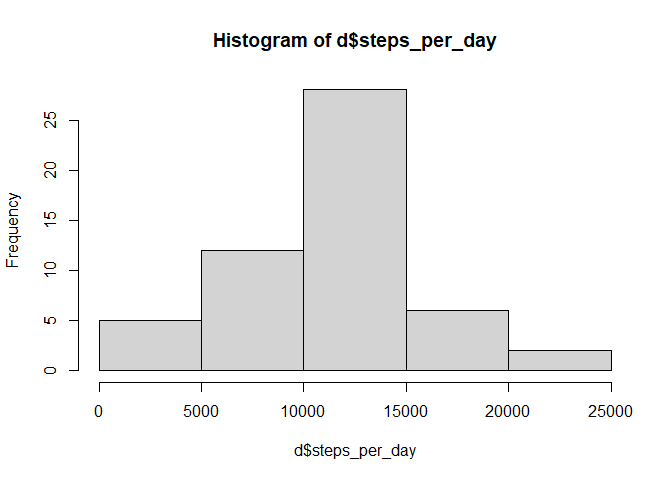
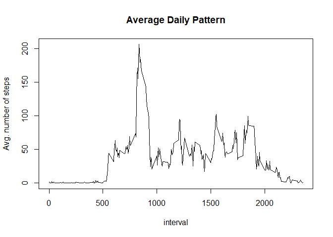
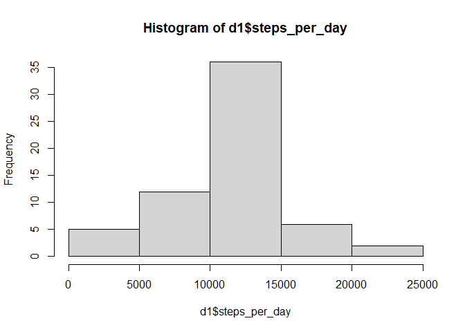
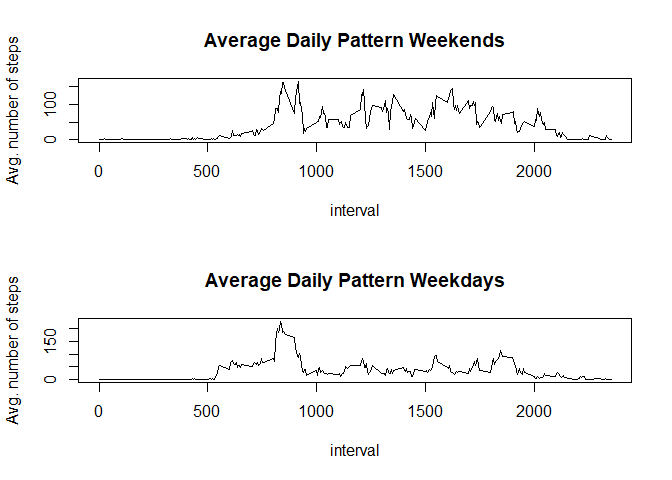

## Loading and preprocessing the data


```r
unzip('activity.zip')
```


```r
library(tidyr)
library(lubridate)
```

```
## 
## Attaching package: 'lubridate'
```

```
## The following objects are masked from 'package:base':
## 
##     date, intersect, setdiff, union
```

```r
library(dplyr)
```

```
## 
## Attaching package: 'dplyr'
```

```
## The following objects are masked from 'package:stats':
## 
##     filter, lag
```

```
## The following objects are masked from 'package:base':
## 
##     intersect, setdiff, setequal, union
```

```r
library(lattice)
df = as_tibble(read.csv('activity.csv'))
df$date = as.Date(df$date)
#df$interval = as.character(df$interval)
```

## What is mean total number of steps taken per day?


```r
d = df %>% group_by(date) %>% 
    summarise(steps_per_day = sum(steps)) %>% 
    select(date,steps_per_day) %>% filter(steps_per_day != 'NA') 
hist(d$steps_per_day)
```

<!-- -->

### Mean and Median of Steps taken


```r
r = d %>% summarise(meanStepsPerDay = mean(steps_per_day), medianStepsPerDay =
    median(steps_per_day)) %>% as.data.frame()
print(r)
```

```
##   meanStepsPerDay medianStepsPerDay
## 1        10766.19             10765
```

## What is the average daily activity pattern?


```r
d = df %>%  filter(steps != 'NA') %>% 
            group_by(interval) %>% 
            summarise(mean=mean(steps))

plot(d$interval,d$mean,main='Average Daily Pattern', xlab = 'interval',
     ylab = 'Avg. number of steps',type='l')
```

<!-- -->

Maximum number of steps below:


```r
mx = d %>% filter(mean == max(mean))
h = substr(mx$interval,1,1)
min_ = substr(mx$interval,2,3)
ini = paste(h,':',min_,sep = '')
final = paste(h,':',as.integer((min_))+5,sep = '')
print(ini)
```

```
## [1] "8:35"
```

```r
print(final)
```

```
## [1] "8:40"
```

The 5-minute interval with maximum average number of steps is 8:35 to 8:40.


## Imputing missing values

### Total number of missing values


```r
missing = is.na(df$steps) %>% sum()
```
There are 2304 missing values in the dataset.

### Filing missing values with mean number of steps in interval


```r
means = df %>%  filter(steps != 'NA') %>% 
            group_by(interval) %>% 
            summarise(mean=mean(steps)) %>% as.data.frame()
rownames(means) = means$interval
means$interval = NULL

# Make copy of df for imputation
df1 = df

# Update df1

for (i in 1:nrow(df1)){
    val = df1[i,'steps'] %>% as.integer()
    if( is.na(val) ){
        # assign to steps in df the mean value in means for time interval
        df1[i,'steps'] = means[as.character(df1[i,'interval']),] %>% round
    }
}

d1 = df1 %>% group_by(date) %>% 
    summarise(steps_per_day = sum(steps)) %>% 
    select(date,steps_per_day) %>% filter(steps_per_day != 'NA') 
hist(d1$steps_per_day)
```

<!-- -->


```r
r1 = d1 %>% summarise(meanStepsPerDay = mean(steps_per_day), medianStepsPerDay =
    median(steps_per_day)) %>% as.data.frame()
comb = bind_rows(r,r1)
rownames(comb) = c('NA removed', 'NA imputed')
comb
```

```
##            meanStepsPerDay medianStepsPerDay
## NA removed        10766.19             10765
## NA imputed        10765.64             10762
```

## Are there differences in activity patterns between weekdays and weekends?

The differences are marginal; there is little impact.


```r
# Compute absolute differences 
r-r1 %>% abs
```

```
##   meanStepsPerDay medianStepsPerDay
## 1        0.549335                 3
```


```r
weekend = function(t){
    ifelse ( t == "Saturday" | t == "Sunday", 'weekend','weekday')}

df1$weekday.end = df1$date %>% weekdays() %>% weekend() %>%
  ordered(levels = c('weekday','weekend'))

# Again probably a slow way:
wdy = df1 %>% filter(weekday.end == 'weekday') %>% group_by(interval) %>%   
          summarise(mean=mean(steps))
wnd = df1 %>% filter(weekday.end == 'weekend') %>% group_by(interval) %>%
          summarise(mean=mean(steps))
par(mfcol=c(2,1))

plot(wnd$interval,wnd$mean,main='Average Daily Pattern Weekends', xlab = 'interval',
     ylab = 'Avg. number of steps',type='l')


plot(wdy$interval,wdy$mean,main='Average Daily Pattern Weekdays', xlab = 'interval',
     ylab = 'Avg. number of steps',type='l')
```

<!-- -->
